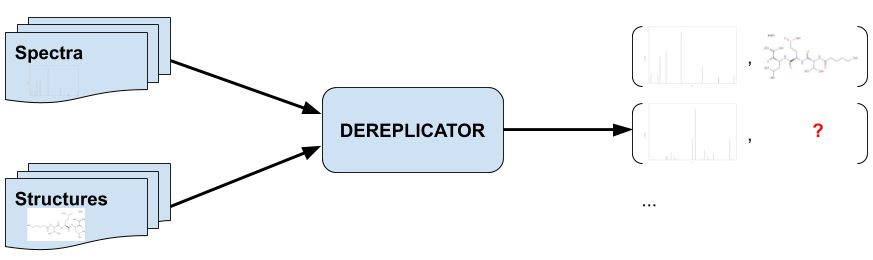
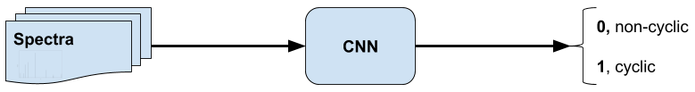
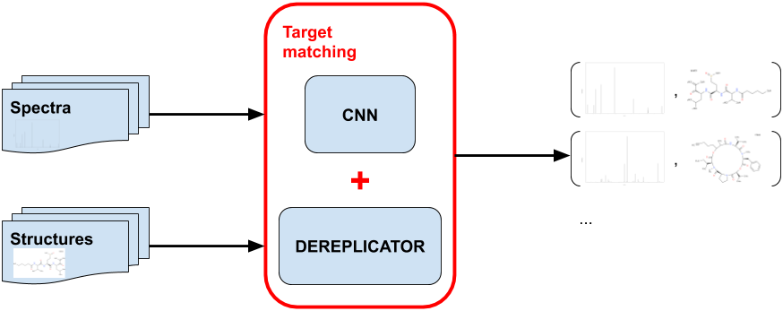

# Machine Learning Engineer Nanodegree
## Capstone Proposal
Elena Bushmanova  
August and September, 2019

## Proposal
<!-- _(approx. 2-3 pages)_ -->

### Domain Background
<!-- _(approx. 1-2 paragraphs)_ -->

<!-- In this section, provide brief details on the background information of the domain from which the project is proposed. Historical information relevant to the project should be included. It should be clear how or why a problem in the domain can or should be solved. Related academic research should be appropriately cited in this section, including why that research is relevant. Additionally, a discussion of your personal motivation for investigating a particular problem in the domain is encouraged but not required. -->

**Peptidic natural products** (PNPs) are small bioactive compounds consisting of amino acids connected via peptide bonds. A PNP may be represented as a graph with amino acids as nodes and bonds as edges. These graphs have either linear, cyclic, or more complex structure. PNPs are important for medicine since many of them are active against bacteria i.e. could be **antibiotics**. One of the main ways to study PNPs is through [mass spectrometry](https://en.wikipedia.org/wiki/Mass_spectrometry). For each PNP you can get a **spectrum** (intensity as a function of the mass-to-charge ratio) or a few by examining it in a black box -- mass spectrometer. These spectra can further be compared against databases of previously characterized compounds using computational methods such as **DEREPLICATOR** ([Mohimani H. et al., 2017](https://www.nature.com/articles/nchembio.2219)).

Understanding which spectra correspond to which types of PNPs structure will significantly speed up the DEREPLICATOR since it will be possible to search through smaller sets (cyclic spectra only against cyclic compounds and linear only against linear). At the same time it will increase precision of the algorithm because initial DEREPLICATOR compares any spectrum with any compound and thereby can get such false positive matching as linear spectrum to nonlinear compound and nonlinear spectra to linear compound (not present in an improved algorithm). Also knowledge about the structure itself (separately from DEREPLICATOR) tells scientists some biological properties of the compound represented by its own spectrum. Cyclic PNPs are more stable and biologically more active on average so we can focus on studying of only such spectra thereby saving our resources.

### Problem Statement
<!-- _(approx. 1 paragraph)_ -->

<!-- In this section, clearly describe the problem that is to be solved. The problem described should be well defined and should have at least one relevant potential solution. Additionally, describe the problem thoroughly such that it is clear that the problem is quantifiable (the problem can be expressed in mathematical or logical terms) , measurable (the problem can be measured by some metric and clearly observed), and replicable (the problem can be reproduced and occurs more than once). -->

The problem of this Capstone project is to **categorize PNPs spectra** into spectra corresponding to **cyclic** compounds and **linear**. Thus the program requires spectrum of the unknown compound as input and defines type of the compound structure as output.

### Datasets and Inputs
<!-- _(approx. 2-3 paragraphs)_ -->

<!-- In this section, the dataset(s) and/or input(s) being considered for the project should be thoroughly described, such as how they relate to the problem and why they should be used. Information such as how the dataset or input is (was) obtained, and the characteristics of the dataset or input, should be included with relevant references and citations as necessary It should be clear how the dataset(s) or input(s) will be used in the project and whether their use is appropriate given the context of the problem. -->

There is already a huge amount of publicly [available](https://gnps.ucsd.edu/) mass spectra of natural products. It turned out to be possible to detect natural products by their mass spectra and also find new ones missing in the database using a high-throughput technology built on computational algorithms such as DEREPLICATOR.

I'm going to use this **one hundred million tandem mass spectra** in the Global Natural Products Social (GNPS) molecular networking infrastructure ([Wang M. et al., 2016](https://www.nature.com/articles/nbt.3597)) to select peptide compounds and categorize them into cyclic and non-cyclic by Machine learning algorithms. The labels can be taken from molecular structures from [GNPS library](https://gnps.ucsd.edu/ProteoSAFe/gnpslibrary.jsp?library=GNPS-LIBRARY#%7B%22Library_Class_input%22%3A%221%7C%7C2%7C%7C3%7C%7CEXACT%22%7D) (trustworthy labels manually obtained by biologists) or from highly-reliable DEREPLICATOR identifications. In both cases it's **several hundred structures** (about 200 cyclic and 100 non-cyclic structures) and about a **thousand spectra** related to them (3-5 different spectra for the structure on average).

Each spectrum is in the [MGF Format](https://ccms-ucsd.github.io/GNPSDocumentation/downloadlibraries/#mgf-format) consisting of list of pairs of mass-to-charge ratio and intensity. The compound structure is in the [Molfile](https://en.wikipedia.org/wiki/Chemical_table_file) containing information about the atoms, bonds, connectivity and molecular coordinates.

### Solution Statement
<!-- _(approx. 1 paragraph)_ -->

<!-- In this section, clearly describe a solution to the problem. The solution should be applicable to the project domain and appropriate for the dataset(s) or input(s) given. Additionally, describe the solution thoroughly such that it is clear that the solution is quantifiable (the solution can be expressed in mathematical or logical terms) , measurable (the solution can be measured by some metric and clearly observed), and replicable (the solution can be reproduced and occurs more than once). -->

It's Supervised learning task because example input-output (namely spectrum-structure) pairs exists. I will start with the simplest **Neural network** model. The advantage of Neural networks approach is the possibility of non-linear models with respect to the features. I plan to try various data representations and then do some preprocessing steps. There are two ways to work with these continuous space of input data: **discretize** the raw spectra or directly **approximate** them by functions. For discretization most likely I will use **CNN** to utilize spatial information and for function approximation -- **usual NN**. Of course I also will try a different models (various layers and etc.) and most **Keras** optimizers. The solution can be measured by common metrics such as **accuracy, precision, recall** and more since there is labeled data.

### Benchmark Model
<!-- _(approximately 1-2 paragraphs)_ -->

<!-- In this section, provide the details for a benchmark model or result that relates to the domain, problem statement, and intended solution. Ideally, the benchmark model or result contextualizes existing methods or known information in the domain and problem given, which could then be objectively compared to the solution. Describe how the benchmark model or result is measurable (can be measured by some metric and clearly observed) with thorough detail. -->

A good result that relates to the domain of Natural products identification would be less elapsed time and less FP at the same time obtained by **target matching DEREPLICATOR** (cyclic spectra against cyclic compounds and linear against linear) than by current DEREPLICATOR pipeline. It will mean that the model correctly classify the spectra by their structures into two groups. Thus the benchmark model is **current DEREPLICATOR** results.

For cyclic-linear classification itself **random model** will be used as benchmark model.

### Evaluation Metrics
<!-- _(approx. 1-2 paragraphs)_ -->

<!-- In this section, propose at least one evaluation metric that can be used to quantify the performance of both the benchmark model and the solution model. The evaluation metric(s) you propose should be appropriate given the context of the data, the problem statement, and the intended solution. Describe how the evaluation metric(s) are derived and provide an example of their mathematical representations (if applicable). Complex evaluation metrics should be clearly defined and quantifiable (can be expressed in mathematical or logical terms). -->

**Accuracy**, **precision**, **recall**, **F1 score** and **FP** as the primary metric are a good choice for evaluation metrics that can be used to quantify the performance of both the benchmark model and the target matching DEREPLICATOR. Here FP means that DEREPLICATOR got a structure that actually doesn't match input spectrum.

Also we can simply compare results of the solution on test set from GNPS library using **FP** metric where false means that spectrum corresponds to other cyclicality than our ML algorithm got.

### Project Design
<!-- _(approx. 1 page)_ -->

<!-- In this final section, summarize a theoretical workflow for approaching a solution given the problem. Provide thorough discussion for what strategies you may consider employing, what analysis of the data might be required before being used, or which algorithms will be considered for your implementation. The workflow and discussion that you provide should align with the qualities of the previous sections. Additionally, you are encouraged to include small visualizations, pseudocode, or diagrams to aid in describing the project design, but it is not required. The discussion should clearly outline your intended workflow of the capstone project. -->

I will be programming in **Python 3** using **pandas**, **NumPy**, **scikit-learn** and mainly **Keras**.

**Fig. 1.** Spectra and compound structures are passed to DEREPLICATOR. DEREPLICATOR outputs spectrum-compound pairs. Not all PNPs could be identified in this way.

**Fig. 2.** Spectra are passed to CNN, CNN outputs cyclicality vector whose components are the probabilities to be cyclic or non-cyclic structures.

**Fig. 3.** Spectra and compound structures are passed to Target matching DEREPLICATOR (spectra are passed to CNN; spectra, compound structures, and cyclicality vector are passed to DEREPLICATOR). Target matching outputs more pairs than DEREPLICATOR alone since CNN helps identify more spectra.

The workflow for approaching a solution given the problem includes
- **Collect** the data. Choose peptide not complex compounds from GNPS Public Spectral Library and also the same highly-reliable DEREPLICATOR identifications.
- **Preprocess** the data. It's necessary to think thoroughly here about a representation of the input spectra since what features will consider our algorithm completely depends on it. Each spectrum can be converted into intensity vector by tiny step discretization in which mass-to-charge ratios are indices and intensities are values (let the length be 50-150 thousand). Also spectrum can be approximated by basis functions like RBF. Maybe it will be meaningful to use some data augmentation to increase the set of input data. After that when I understand the data I will identify what kind of preprocessing is needed: scaling, normalization and so on.
- **Split** the data into training, validation and test sets such that both linear and cyclic compounds fall into each of these sets in acceptable proportions.
- **Choose**, **train** and **tune** the model. The initial CNN could include 2 convolutional layers (anyway up to 4 due to the large length of intensity vector), each with 4 filters of size 1×4 and two fully connected layers of 512 and 2 (number of output categories) neuron units. We also use tanh or ReLU activation, max-pooling, and dropout to prevent overfitting. Then I get some intuitions about how these networks work on spectra data by testing them and plotting some scores, change initial model varying layers and other hyperparameters, use different optimizers and also try any more models. There are some articles about Deep learning on mass spectra data into which I want to dig deeper (mainly [Tran N. H. et al., 2017](https://www.pnas.org/content/114/31/8247) and [2019](https://www.nature.com/articles/s41592-018-0260-3))
- **Evaluate** the solution. After getting two groups of spectra by approved network run DEREPLICATOR for cyclic spectra against cyclic compounds and linear against linear separately. Compare FP and elapsed time for these results and for DEREPLICATOR on full set of spectra. Also compute FP for approved network without considering DEREPLICATOR pipeline.

<!-- ----------- -->

<!-- **Before submitting your proposal, ask yourself. . .** -->

<!-- - Does the proposal you have written follow a well-organized structure similar to that of the project template? -->
<!-- - Is each section (particularly **Solution Statement** and **Project Design**) written in a clear, concise and specific fashion? Are there any ambiguous terms or phrases that need clarification? -->
<!-- - Would the intended audience of your project be able to understand your proposal? -->
<!-- - Have you properly proofread your proposal to assure there are minimal grammatical and spelling mistakes? -->
<!-- - Are all the resources used for this project correctly cited and referenced? -->
