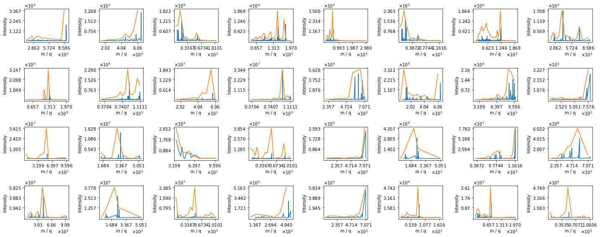
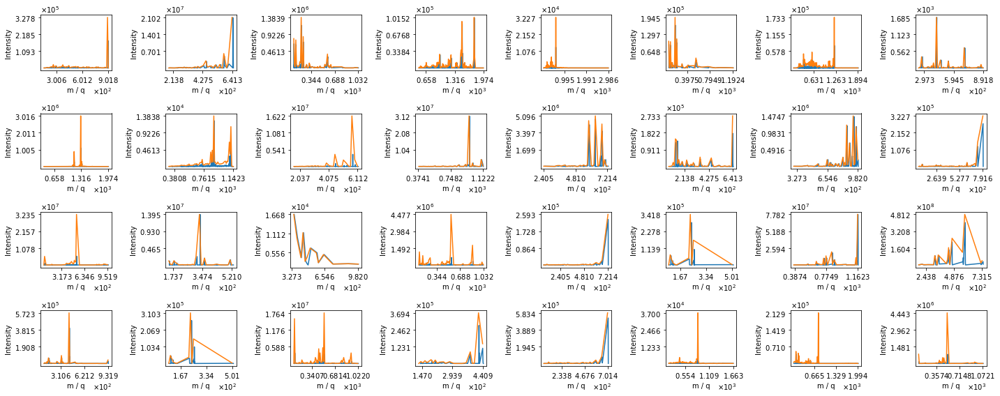
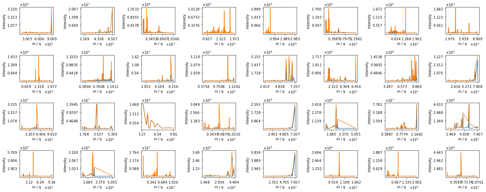
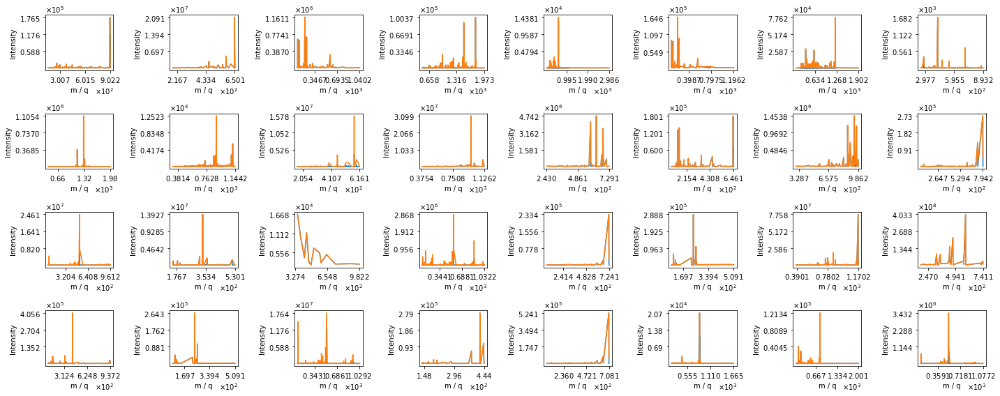
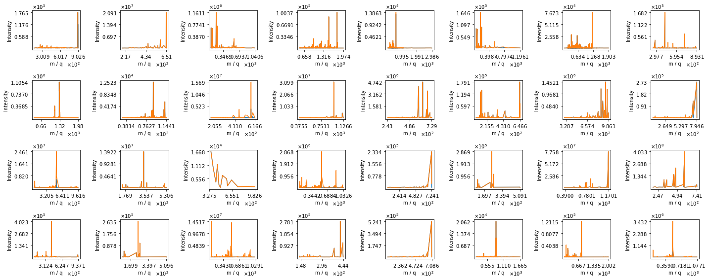
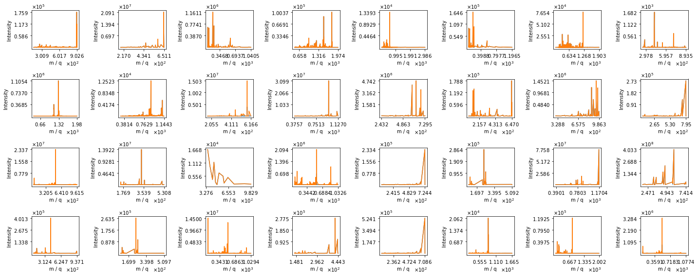

# Machine Learning Engineer Nanodegree
## Capstone Project
Elena Bushmanova  
September and October, 2019

## I. Definition
<!-- _(approx. 1-2 pages)_ -->

### Project Overview

**Peptidic natural products** (PNPs) are small bioactive compounds consisting of amino acids connected via peptide bonds. A PNP may be represented as a graph with amino acids as nodes and bonds as edges. These graphs have either linear, cyclic, or more complex structure. PNPs are important for medicine since many of them are active against bacteria i.e. could be **antibiotics**. One of the main ways to study PNPs is through [mass spectrometry](https://en.wikipedia.org/wiki/Mass_spectrometry). For each PNP you can get a **spectrum** (intensity as a function of the mass-to-charge ratio) or a few by examining it in a black box -- mass spectrometer. These spectra can further be compared against databases of previously characterized compounds using computational methods such as **DEREPLICATOR** ([Mohimani H. et al., 2017](https://www.nature.com/articles/nchembio.2219)).

Understanding which spectra correspond to which types of PNPs structure will significantly speed up the DEREPLICATOR since it will be possible to search through smaller sets (cyclic spectra only against cyclic compounds and linear only against linear). At the same time it will increase precision of the algorithm because initial DEREPLICATOR compares any spectrum with any compound and thereby can get such false positive matching as linear spectrum to non-linear compound and non-linear spectra to linear compound (not present in an improved algorithm). Also knowledge about the structure itself (separately from DEREPLICATOR) tells scientists some biological properties of the compound represented by its own spectrum. Cyclic PNPs are more stable and biologically more active on average so we can focus on studying of only such spectra thereby saving our resources.

There are already a huge amount of publicly [available](https://gnps.ucsd.edu/) mass spectra of natural products and some articles about Deep learning on mass spectra data into which I want to dig deeper (mainly [Tran N. H. et al., 2017](https://www.pnas.org/content/114/31/8247) and [2019](https://www.nature.com/articles/s41592-018-0260-3)). It turned out to be possible to detect natural products by their mass spectra and also find new ones missing in the database using a high-throughput technology built on computational algorithms. I'm going to use this one hundred million tandem mass spectra in the Global Natural Products Social (GNPS) molecular networking infrastructure ([Wang M. et al., 2016](https://www.nature.com/articles/nbt.3597)) to select peptide compounds and classify them using Machine learning algorithms. The labels can be taken from molecular structures from [GNPS library](https://gnps.ucsd.edu/ProteoSAFe/gnpslibrary.jsp?library=GNPS-LIBRARY#%7B%22Library_Class_input%22%3A%221%7C%7C2%7C%7C3%7C%7CEXACT%22%7D) (trustworthy labels manually obtained by biologists) or from highly-reliable DEREPLICATOR identifications. In both cases it's **several hundred cyclic and non-cyclic structures** and **several thousand spectra** related to them (3-5 different spectra for the structure on average).

### Problem Statement

The problem of this Capstone project is to **categorize PNPs spectra** into spectra corresponding to **cyclic** and **linear** compounds (branch-cyclic and complex classes can also be considered). Thus the program requires spectrum of the unknown compound as input and defines type of the compound structure as output.

The workflow for approaching a solution given the problem includes
- **Collect** the data. Choose peptide not complex compounds from GNPS Public Spectral Library and also the same highly-reliable DEREPLICATOR identifications.
- **Preprocess** the data. Convert each spectrum into intensity vector by discretization in which mass-to-charge ratios are indices and intensities are values. Try different sizes of discretization step to vary number of features and feasible network complexity which doesn't kill all the RAM.
- **Split** the data into training, validation and test sets such that both linear and cyclic compounds fall into each of these sets in acceptable proportions.
- **Choose**, **train** and **tune** the model. At first make sure that such simple models as [clustering](https://scikit-learn.org/stable/modules/clustering.html) do not work (try K-means, Gaussian mixtures or Hierarchical clustering). Secondly try [SVC](https://scikit-learn.org/stable/modules/generated/sklearn.svm.SVC.html) and at the end build first one [CNN](https://keras.io/layers/convolutional/). <!--consisting of two convolutional layers with two subsequent max-pooling layers, two fully connected layers and two dropouts to prevent overfitting. --> Get some intuitions about how the models work on spectra data by testing them and plotting some scores, varying layers and other hyperparameters, use different optimizers and etc.
- **Evaluate** the solution. <!--After getting two groups of spectra by approved network run DEREPLICATOR for cyclic spectra against cyclic compounds and linear against linear separately. Compare FP and elapsed time for these results and for DEREPLICATOR on full set of spectra. Also c--> Visualize some predictions. Compare with random model by computing [confusion matrix](https://scikit-learn.org/stable/modules/generated/sklearn.metrics.confusion_matrix.html), [Receiver operating characteristic](https://scikit-learn.org/stable/modules/generated/sklearn.metrics.roc_curve.html) and the area under this curve [AUC](https://scikit-learn.org/stable/modules/generated/sklearn.metrics.auc.html). <!--without considering DEREPLICATOR pipeline.-->

### Metrics

**Confusion matrix** was chosen to show how many and what type of mistakes the model made on test dataset. *False* means that spectrum corresponds to other cyclicality than the model got. So *FP* is the number of spectra corresponding to non-linear compounds predicted as linear and vice versa *FN* means that actually linear compound is predicted as non-linear.

**ROC curves** and **AUC** will measure performance of the model instead of *accuracy* since the dataset can't be considered fully balanced and the model may have a large accuracy but be unfair owing to [Accuracy paradox](https://towardsdatascience.com/accuracy-paradox-897a69e2dd9b)). In its turn AUC has to deal with the small imbalance of input data. <!--, **precision**, **recall**, **F1 score** and **FP** as the primary metric are a good choice for evaluation metrics that can be used to quantify the performance of both the current DEREPLICATOR (in the sense of benchmark model) and the Target matching DEREPLICATOR. Here FP means that DEREPLICATOR got a structure that actually doesn't match input spectrum. -->

## II. Analysis

### Data Exploration
Each spectrum is in the [MGF Format](https://ccms-ucsd.github.io/GNPSDocumentation/downloadlibraries/#mgf-format) consisting of list of pairs of mass-to-charge ratio and intensity (see ```data/spectra/*.mgf```, ```data/spectra_REG_RUN/*.mgf``` or ```data/GNPS-LIBRARY.mgf```). To make it clearer here is some example of such file:
```
BEGIN IONS
PEPMASS=712.31
CHARGE=0
MSLEVEL=2
SOURCE_INSTRUMENT=LC-ESI-qTof
IONMODE=Positive
NAME=Microcolin C M+Na
SMILES=CCCC[C@@H](C)C[C@@H](C)C(N(C)[C@@H](CC(C)C)C(N[C@H]([C@H](O)C)C(N(C)[C@H](C(C)C)C(N1[C@@H](C(N2C(C=C[C@@H]2C)=O)=O)CCC1)=O)=O)=O)=O
SPECTRUMID=CCMSLIB00000001660
SCANS=1
271.888367 17345.0
289.879761 28408.0
329.993896 100546.0
331.070801 33707.0
.
.
.
714.161499 1.0
END IONS
```
For **spectra from GNPS library** [Marvin](https://chemaxon.com/products/marvin) suite is used to get information about compound structure from field of MGF file named SMILES.
```
molconvert mol:V3+H -s 'SMILES' -o Molfile
```
So the compound structure is in the [Molfile](https://en.wikipedia.org/wiki/Chemical_table_file) containing information about the atoms, bonds, connectivity and molecular coordinates (see ```data/mols/*.mol```). It turned out that half of all spectra namely 2419 of 4666 don't have SMILES and therefore were filtered out. Here is some example of Molfile:
```
  Mrv1920 10081913022D          

  0  0  0     0  0            999 V3000
M  V30 BEGIN CTAB
M  V30 COUNTS 112 113 0 0 1
M  V30 BEGIN ATOM
M  V30 1 C 0.6359 -23.6727 0 0
M  V30 2 C 1.9696 -24.4427 0 0
M  V30 3 C 3.3032 -23.6727 0 0
M  V30 4 C 4.6369 -24.4427 0 0
M  V30 5 C 5.9706 -23.6727 0 0 CFG=1
M  V30 6 C 5.9706 -22.1327 0 0
.
.
.
M  V30 113 1 45 112
M  V30 END BOND
M  V30 END CTAB
M  END
```
Molfile obtained previously helps identify whether the spectrum corresponds to peptidic compound or not. Compound with number of components more than 3 is recognized as peptidic. Number of components is obtained using [Natural Product Discovery tools](https://github.com/ablab/npdtools) by command line below. In total 443 spectra correspond to the peptide compounds.
```
print_structure Molfile -C share/npdtools/ --print_rule_fragmented_graph

number of components : 6
0 C10H19O 155.144
1 C7H13NO 127.1
2 C4H7NO2 101.048
3 C6H11NO 113.084
4 C5H7NO 97.0528
5 C5H6NO 96.0449
number of bonds : 6
1 -NC> 0
2 -NC> 1
3 -NC> 2
4 -NC> 3
5 -NC> 4
5 -NC> 5
```
Finally, the following command is used to determine type of the compound structure:
```
print_structure Molfile -C share/npdtools/ --print_structure

branch-cyclic
```
As a result, *85 linear*, *82 cyclic*, *71 branch-cyclic* and *205 complex* spectra were founded.

Information about spectra **structures identified by DEREPLICATOR** can be founded in [tab-separated values](https://en.wikipedia.org/wiki/Tab-separated_values) ```data/REG_RUN_GNPS/regrun_fdr0_complete.tsv```. Where *LocalSpecIdx* field means the spectrum number in the file in *SpecFile* field and this spectrum corresponds to a compound whose cyclicality is in the *Structure* field.
```
Dataset	Id	SpecFile	LocalSpecIdx	Scan	LocalPeptideIdx	Name	Score	P-Value	PeptideMass	SpectrumMass	Retention	Adduct	Charge	FScore	MolFile	Family	Structure
MSV000078556	0	REG_fdr0_spectra/MSV000078556.mgf	0	0	8568	L-Valyl-L-leucyl-L-prolyl-L-valyl-L-prol	9	1.5e-21	651.396	652.403	155.54399999999998	M+H	1	20.82390874094432	combined_db/mol_dir/antimarin2012_54685.mol	423	linear
MSV000078556	1	REG_fdr0_spectra/MSV000078556.mgf	1	1	8568	L-Valyl-L-leucyl-L-prolyl-L-valyl-L-prol	9	1.2e-22	651.396	652.406	156.215	M+H	1	21.920818753952375	combined_db/mol_dir/antimarin2012_54685.mol	423	linear
MSV000078556	2	REG_fdr0_spectra/MSV000078556.mgf	2	2	8568	L-Valyl-L-leucyl-L-prolyl-L-valyl-L-prol	9	1.2e-16	651.396	652.406	157.319	M+H	1	15.920818753952375	combined_db/mol_dir/antimarin2012_54685.mol	423	linear
MSV000078556	3	REG_fdr0_spectra/MSV000078556.mgf	3	3	8363	a-Substance_Ib	8	3.4e-14	685.3910000000001	343.705	171.40099999999998	M+2H	2	13.468521082957745	combined_db/mol_dir/antimarin2012_37467.mol	543	linear
.
.
.
MSV000080116	9	REG_fdr0_spectra/MSV000080116.mgf	9	9	6225	Surfactin_1-Me_ester	15	1e-15	1049.7	1050.71	476.026	M+H	1	15.0	combined_db/mol_dir/QMN75-K.mol	7	cyclic

```
DEREPLICATOR identifies *7505 peptidic* spectra (*3101 linear*, *2681 cyclic*, *1692 branch-cyclic* and *31 complex*).

To get started, to slightly simplify the task, I remove from consideration all spectra corresponding to complex and branch-cyclic compounds. Also as it can be seen above there is small **imbalance of input data** (*3186 linear* and *2763 cyclic* spectra).

### Exploratory Visualization
The plots below shows **first 32 spectra and their discretizations** with various step size. Mass-to-charge ratio along X axis ranges from 0 to 5 000 and is divided into 100, 500, 1 000, 5 000, 10 000 and 50 000 intervals. The intensities are on Y axis and those of them that fall into one mass-to-charge ratio interval are summed.


**Fig. 1.** Mass-to-charge ratio range is divided into **100 intervals**. The **dimensionality** of the problem turned out equal to **60** as long as intervals in which no intensity of any spectrum has fallen are not considered by the model as a features. Not all peaks are caught, only the general form of the spectrum can be guessed.


**Fig. 2.** Mass-to-charge ratio range is divided into **500 intervals**. The **dimensionality** of the problem is **297**. Most peaks of input spectrum are visible in discretization, but nearby peaks are still glued together.


**Fig. 3.** Here is **1000** intervals. The dimensionality is about **594**. It can be seen that the discretization is still a bit closer to the original data and most likely the model will already be able to work well with such data.


**Fig. 4.** Number of intervals is **5000**, dimensionality is **2915**. In these plots the blue color is almost completely hidden to the eyes, the discretization is already in good agreement with the input spectra.


**Fig. 5.** Number of intervals is **10000**, dimensionality is **5572**. The difference with the previous discretization is almost invisible to the eye, however, the dimension of the model is still increasing.


**Fig. 6.** Number of intervals is **50000**, dimensionality is **23325**. This is more than enough to train the model so let's finish this. But it's still not all existing peaks, there are **783 055** different peaks in the original spectra.

We see here that even large step discretization allows to recognize most of the peaks. This gives a hope that it's possible to **reduce the dimensionality** of the problem meaning number of features considered by the model **not losing much** in quality at the same time. It's necessary to think thoroughly here about a representation of the input spectra since what kind and how many features will consider our algorithm completely depends on it. So this is helpful for understanding the data and choosing the model dimensionality and complexity.

### Algorithms and Techniques
It's Supervised learning task because example input-output (namely spectrum-structure) pairs exists. I will start with small **Neural Network** or even clustering algorithms (**K-means**, **Gaussian mixtures**, **Hierarchical clustering**) and **Support Vector Classification**. There are two ways to work with these continuous space of input data: **discretize** the raw spectra or directly **approximate** them by functions. For discretization most likely will be suitable to use **CNN** to utilize spatial information and for function approximation -- **usual NN**. For now I will focus only on discretization. I plan to try various data representations and do some preprocessing steps (different step size for discretization, summarizing peaks within a single bin, replacement *NaNs* with zero in intensity vectors, remove zero features and etc).

- **Clustering** The number of clusters are known and equals 2 (linear and non-linear), other parameters will be left by default.
- **Support Vector Machine** Can use default parameters but don't forget about ```class_weight='balanced'``` because the data has small imbalance.
- **Neural networks** The advantage of Neural networks approach is the possibility of non-linear models with respect to the features. CNN will include 2 convolutional layers (anyway up to 4 due to the large length of intensity vector), each with 64 filters of size 4 and two fully connected layers of 64 and 2 (number of output categories) neuron units. We also use *tanh* or *ReLU* activation, max-pooling, and dropout to prevent overfitting. Of course I also will try a different models (various layers and etc.) and most **Keras** optimizers.

### Benchmark
<!--A good result that relates to the domain of Natural products identification would be less elapsed time and less FP at the same time obtained by **target matching DEREPLICATOR** (cyclic spectra against cyclic compounds and linear against linear) than by current DEREPLICATOR pipeline. It will mean that the model correctly classify the spectra by their structures into two groups. Thus the benchmark model is **current DEREPLICATOR** results.-->

The solution can be measured by common metrics such as **AUC**, **precision**, **recall** and more since there is labeled data. For cyclic-linear classification **random model** will be used as benchmark model. If the model outperform random model it will be a good enough result.

## III. Methodology
<!-- _(approx. 3-5 pages)_ -->

### Data Preprocessing
<!-- In this section, all of your preprocessing steps will need to be clearly documented, if any were necessary. From the previous section, any of the abnormalities or characteristics that you identified about the dataset will be addressed and corrected here. Questions to ask yourself when writing this section: -->
<!-- - _If the algorithms chosen require preprocessing steps like feature selection or feature transformations, have they been properly documented?_ -->
<!-- - _Based on the **Data Exploration** section, if there were abnormalities or characteristics that needed to be addressed, have they been properly corrected?_ -->
<!-- - _If no preprocessing is needed, has it been made clear why?_ -->
Each spectrum can be converted into intensity vector by tiny step discretization in which mass-to-charge ratios are indices and intensities are values (let the length be 50-150 thousand).

### Implementation
<!-- In this section, the process for which metrics, algorithms, and techniques that you implemented for the given data will need to be clearly documented. It should be abundantly clear how the implementation was carried out, and discussion should be made regarding any complications that occurred during this process. Questions to ask yourself when writing this section: -->
<!-- - _Is it made clear how the algorithms and techniques were implemented with the given datasets or input data?_ -->
<!-- - _Were there any complications with the original metrics or techniques that required changing prior to acquiring a solution?_ -->
<!-- - _Was there any part of the coding process (e.g., writing complicated functions) that should be documented?_ -->
I will use **Python 3** with **pandas**, **NumPy**, **scikit-learn** and mainly **Keras**. Some steps have already been done in ```capstone.ipynb``` to get input data representation.

### Refinement
<!-- In this section, you will need to discuss the process of improvement you made upon the algorithms and techniques you used in your implementation. For example, adjusting parameters for certain models to acquire improved solutions would fall under the refinement category. Your initial and final solutions should be reported, as well as any significant intermediate results as necessary. Questions to ask yourself when writing this section: -->
<!-- - _Has an initial solution been found and clearly reported?_ -->
<!-- - _Is the process of improvement clearly documented, such as what techniques were used?_ -->
<!-- - _Are intermediate and final solutions clearly reported as the process is improved?_ -->


## IV. Results
<!-- _(approx. 2-3 pages)_ -->

### Model Evaluation and Validation
<!-- In this section, the final model and any supporting qualities should be evaluated in detail. It should be clear how the final model was derived and why this model was chosen. In addition, some type of analysis should be used to validate the robustness of this model and its solution, such as manipulating the input data or environment to see how the model’s solution is affected (this is called sensitivity analysis). Questions to ask yourself when writing this section: -->
<!-- - _Is the final model reasonable and aligning with solution expectations? Are the final parameters of the model appropriate?_ -->
<!-- - _Is the model robust enough for the problem? Do small perturbations (changes) in training data or the input space greatly affect the results?_ -->
<!-- - _Can results found from the model be trusted?_ -->
<!-- - _Has the final model been tested with various inputs to evaluate whether the model generalizes well to unseen data?_ -->


### Justification
<!-- In this section, your model’s final solution and its results should be compared to the benchmark you established earlier in the project using some type of statistical analysis. You should also justify whether these results and the solution are significant enough to have solved the problem posed in the project. Questions to ask yourself when writing this section: -->
<!-- - _Are the final results found stronger than the benchmark result reported earlier?_ -->
<!-- - _Have you thoroughly analyzed and discussed the final solution?_ -->
<!-- - _Is the final solution significant enough to have solved the problem?_ -->

After getting two groups of spectra by approved network run DEREPLICATOR for cyclic spectra against cyclic compounds and linear against linear separately. Compare FP and elapsed time for these results and for DEREPLICATOR on full set of spectra. Also compare with random model and compute FP for approved network without considering DEREPLICATOR pipeline.

## V. Conclusion
<!-- _(approx. 1-2 pages)_ -->

### Free-Form Visualization
<!-- In this section, you will need to provide some form of visualization that emphasizes an important quality about the project. It is much more free-form, but should reasonably support a significant result or characteristic about the problem that you want to discuss. Questions to ask yourself when writing this section: -->
<!-- - _Have you visualized a relevant or important quality about the problem, dataset, input data, or results?_ -->
<!-- - _Is the visualization thoroughly analyzed and discussed?_ -->
<!-- - _If a plot is provided, are the axes, title, and datum clearly defined?_ -->

### Reflection
<!-- In this section, you will summarize the entire end-to-end problem solution and discuss one or two particular aspects of the project you found interesting or difficult. You are expected to reflect on the project as a whole to show that you have a firm understanding of the entire process employed in your work. Questions to ask yourself when writing this section: -->
<!-- - _Have you thoroughly summarized the entire process you used for this project?_ -->
<!-- - _Were there any interesting aspects of the project?_ -->
<!-- - _Were there any difficult aspects of the project?_ -->
<!-- - _Does the final model and solution fit your expectations for the problem, and should it be used in a general setting to solve these types of problems?_ -->

### Improvement
<!-- In this section, you will need to provide discussion as to how one aspect of the implementation you designed could be improved. As an example, consider ways your implementation can be made more general, and what would need to be modified. You do not need to make this improvement, but the potential solutions resulting from these changes are considered and compared/contrasted to your current solution. Questions to ask yourself when writing this section: -->
<!-- - _Are there further improvements that could be made on the algorithms or techniques you used in this project?_ -->
<!-- - _Were there algorithms or techniques you researched that you did not know how to implement, but would consider using if you knew how?_ -->
<!-- - _If you used your final solution as the new benchmark, do you think an even better solution exists?_ -->

<!-- ----------- -->

<!-- **Before submitting, ask yourself. . .** -->

<!-- - Does the project report you’ve written follow a well-organized structure similar to that of the project template? -->
<!-- - Is each section (particularly **Analysis** and **Methodology**) written in a clear, concise and specific fashion? Are there any ambiguous terms or phrases that need clarification? -->
<!-- - Would the intended audience of your project be able to understand your analysis, methods, and results? -->
<!-- - Have you properly proof-read your project report to assure there are minimal grammatical and spelling mistakes? -->
<!-- - Are all the resources used for this project correctly cited and referenced? -->
<!-- - Is the code that implements your solution easily readable and properly commented? -->
<!-- - Does the code execute without error and produce results similar to those reported? -->
