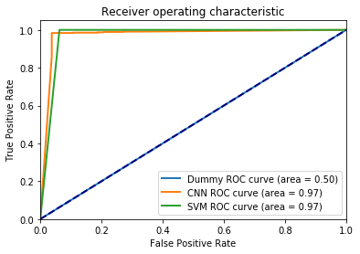
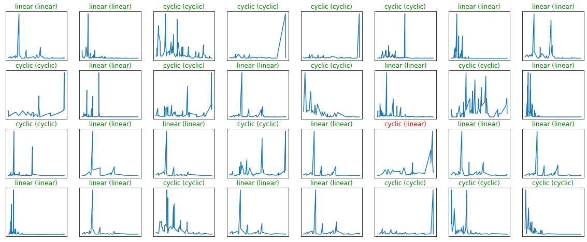
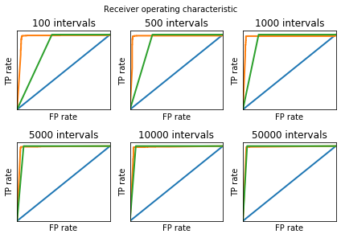

# Machine Learning Engineer Nanodegree
## Capstone Project
Elena Bushmanova  
September and October, 2019

## I. Definition
<!-- _(approx. 1-2 pages)_ -->

### Project Overview

**Peptidic natural products** (PNPs) are small bioactive compounds consisting of amino acids connected via peptide bonds. A PNP may be represented as a graph with amino acids as nodes and bonds as edges. These graphs have either linear, cyclic, or more complex structure. PNPs are important for medicine since many of them are active against bacteria i.e. could be **antibiotics**. One of the main ways to study PNPs is through [mass spectrometry](https://en.wikipedia.org/wiki/Mass_spectrometry). For each PNP you can get a **spectrum** (intensity as a function of the mass-to-charge ratio) or a few by examining it in a black box -- mass spectrometer. These spectra can further be compared against databases of previously characterized compounds using computational methods such as **DEREPLICATOR** ([Mohimani H. et al., 2017](https://www.nature.com/articles/nchembio.2219)).

Understanding which spectra correspond to which types of PNPs structure will significantly speed up the DEREPLICATOR since it will be possible to search through smaller sets (cyclic spectra only against cyclic compounds and linear only against linear). At the same time it will increase precision of the algorithm because initial DEREPLICATOR compares any spectrum with any compound and thereby can get such false positive matching as linear spectrum to non-linear compound and non-linear spectra to linear compound (not present in an improved algorithm). Also knowledge about the structure itself (separately from DEREPLICATOR) tells scientists some biological properties of the compound represented by its own spectrum. Cyclic PNPs are more stable and biologically more active on average so we can focus on studying of only such spectra thereby saving our resources.

There are already a huge amount of publicly [available](https://gnps.ucsd.edu/) mass spectra of natural products and some articles about Deep learning on mass spectra data into which I want to dig deeper (mainly [Tran N. H. et al., 2017](https://www.pnas.org/content/114/31/8247) and [2019](https://www.nature.com/articles/s41592-018-0260-3)). It turned out to be possible to detect natural products by their mass spectra and also find new ones missing in the database using a high-throughput technology built on computational algorithms. I'm going to use this one hundred million tandem mass spectra in the Global Natural Products Social (GNPS) molecular networking infrastructure ([Wang M. et al., 2016](https://www.nature.com/articles/nbt.3597)) to select peptide compounds and classify them using Machine learning algorithms. The labels can be taken from molecular structures from [GNPS library](https://gnps.ucsd.edu/ProteoSAFe/gnpslibrary.jsp?library=GNPS-LIBRARY#%7B%22Library_Class_input%22%3A%221%7C%7C2%7C%7C3%7C%7CEXACT%22%7D) (trustworthy labels manually obtained by biologists) or from highly-reliable DEREPLICATOR identifications. In both cases it's **several hundred cyclic and non-cyclic structures** and **several thousand spectra** related to them (3-5 different spectra for the structure on average).

### Problem Statement

The problem of this Capstone project is to **categorize PNPs spectra** into spectra corresponding to **cyclic** and **linear** compounds (branch-cyclic and complex classes can also be considered). Thus the program requires spectrum of the unknown compound as input and defines type of the compound structure as output.

The workflow for approaching a solution given the problem includes
- **Collect** the data. Choose peptide not complex compounds from GNPS Public Spectral Library and also the same highly-reliable DEREPLICATOR identifications.
- **Preprocess** the data. Try different sizes of discretization step to vary number of features and feasible network complexity which doesn't kill all the RAM.
- **Split** the data into training, validation and test sets such that both linear and cyclic compounds fall into each of these sets in acceptable proportions.
- **Choose**, **train** and **tune** the model. At first make sure that such simple models as [clustering](https://scikit-learn.org/stable/modules/clustering.html) do not work (try K-means, Gaussian mixtures or Hierarchical clustering). Secondly try [SVC](https://scikit-learn.org/stable/modules/generated/sklearn.svm.SVC.html) and at the end build first one [CNN](https://keras.io/layers/convolutional/). <!--consisting of two convolutional layers with two subsequent max-pooling layers, two fully connected layers and two dropouts to prevent overfitting. --> Get some intuitions about how the models work on spectra data by testing them and plotting some scores, varying layers and other hyperparameters, use different optimizers and etc.
- **Evaluate** the solution. Visualize some predictions. Compare with random model by computing [confusion matrix](https://scikit-learn.org/stable/modules/generated/sklearn.metrics.confusion_matrix.html), [Receiver operating characteristic](https://scikit-learn.org/stable/modules/generated/sklearn.metrics.roc_curve.html) and the area under this curve [AUC](https://scikit-learn.org/stable/modules/generated/sklearn.metrics.auc.html). <!--without considering DEREPLICATOR pipeline.-->

### Metrics

**Confusion matrix** was chosen to show how many and what type of mistakes the model made on test dataset. *False* means that spectrum corresponds to other cyclicality than the model got. So *FP* is the number of spectra corresponding to non-linear compounds predicted as linear and vice versa *FN* means that actually linear compound is predicted as non-linear.

**ROC curves** and **AUC** will measure performance of the model instead of *accuracy* since the dataset can't be considered fully balanced and the model may have a large accuracy but be unfair owing to [Accuracy paradox](https://towardsdatascience.com/accuracy-paradox-897a69e2dd9b)). In its turn AUC has to deal with the small imbalance of input data.
## II. Analysis

### Data Exploration
Each spectrum is in the [MGF Format](https://ccms-ucsd.github.io/GNPSDocumentation/downloadlibraries/#mgf-format) consisting of list of pairs of mass-to-charge ratio and intensity (see ```data/spectra/*.mgf```, ```data/spectra_REG_RUN/*.mgf``` or ```data/GNPS-LIBRARY.mgf```). To make it clearer here is some example of such file:
```
BEGIN IONS
PEPMASS=712.31
CHARGE=0
MSLEVEL=2
SOURCE_INSTRUMENT=LC-ESI-qTof
IONMODE=Positive
NAME=Microcolin C M+Na
SMILES=CCCC[C@@H](C)C[C@@H](C)C(N(C)[C@@H](CC(C)C)C(N[C@H]([C@H](O)C)C(N(C)[C@H](C(C)C)C(N1[C@@H](C(N2C(C=C[C@@H]2C)=O)=O)CCC1)=O)=O)=O)=O
SPECTRUMID=CCMSLIB00000001660
SCANS=1
271.888367 17345.0
289.879761 28408.0
329.993896 100546.0
331.070801 33707.0
.
.
.
714.161499 1.0
END IONS
```
For **spectra from GNPS library** [Marvin](https://chemaxon.com/products/marvin) suite is used to get information about compound structure from field of MGF file named SMILES.
```
molconvert mol:V3+H -s 'SMILES' -o Molfile
```
So the compound structure is in the [Molfile](https://en.wikipedia.org/wiki/Chemical_table_file) containing information about the atoms, bonds, connectivity and molecular coordinates (see ```data/mols/*.mol```). It turned out that half of all spectra namely 2419 of 4666 don't have SMILES and therefore were filtered out. Here is some example of Molfile:
```
  Mrv1920 10081913022D          

  0  0  0     0  0            999 V3000
M  V30 BEGIN CTAB
M  V30 COUNTS 112 113 0 0 1
M  V30 BEGIN ATOM
M  V30 1 C 0.6359 -23.6727 0 0
M  V30 2 C 1.9696 -24.4427 0 0
M  V30 3 C 3.3032 -23.6727 0 0
M  V30 4 C 4.6369 -24.4427 0 0
M  V30 5 C 5.9706 -23.6727 0 0 CFG=1
M  V30 6 C 5.9706 -22.1327 0 0
.
.
.
M  V30 113 1 45 112
M  V30 END BOND
M  V30 END CTAB
M  END
```
Molfile obtained previously helps identify whether the spectrum corresponds to peptidic compound or not. Compound with number of components more than 3 is recognized as peptidic. Number of components is obtained using [Natural Product Discovery tools](https://github.com/ablab/npdtools) by command line below. In total 443 spectra correspond to the peptide compounds.
```
print_structure Molfile -C share/npdtools/ --print_rule_fragmented_graph

number of components : 6
0 C10H19O 155.144
1 C7H13NO 127.1
2 C4H7NO2 101.048
3 C6H11NO 113.084
4 C5H7NO 97.0528
5 C5H6NO 96.0449
number of bonds : 6
1 -NC> 0
2 -NC> 1
3 -NC> 2
4 -NC> 3
5 -NC> 4
5 -NC> 5
```
Finally, the following command is used to determine type of the compound structure:
```
print_structure Molfile -C share/npdtools/ --print_structure

branch-cyclic
```
As a result, *85 linear*, *82 cyclic*, *71 branch-cyclic* and *205 complex* spectra were founded.

Information about spectra **structures identified by DEREPLICATOR** can be founded in [tab-separated values](https://en.wikipedia.org/wiki/Tab-separated_values) ```data/REG_RUN_GNPS/regrun_fdr0_complete.tsv```. Where *LocalSpecIdx* field means the spectrum number in the file in *SpecFile* field and this spectrum corresponds to a compound whose cyclicality is in the *Structure* field.
```
Dataset	Id	SpecFile	LocalSpecIdx	Scan	LocalPeptideIdx	Name	Score	P-Value	PeptideMass	SpectrumMass	Retention	Adduct	Charge	FScore	MolFile	Family	Structure
MSV000078556	0	REG_fdr0_spectra/MSV000078556.mgf	0	0	8568	L-Valyl-L-leucyl-L-prolyl-L-valyl-L-prol	9	1.5e-21	651.396	652.403	155.54399999999998	M+H	1	20.82390874094432	combined_db/mol_dir/antimarin2012_54685.mol	423	linear
MSV000078556	1	REG_fdr0_spectra/MSV000078556.mgf	1	1	8568	L-Valyl-L-leucyl-L-prolyl-L-valyl-L-prol	9	1.2e-22	651.396	652.406	156.215	M+H	1	21.920818753952375	combined_db/mol_dir/antimarin2012_54685.mol	423	linear
MSV000078556	2	REG_fdr0_spectra/MSV000078556.mgf	2	2	8568	L-Valyl-L-leucyl-L-prolyl-L-valyl-L-prol	9	1.2e-16	651.396	652.406	157.319	M+H	1	15.920818753952375	combined_db/mol_dir/antimarin2012_54685.mol	423	linear
MSV000078556	3	REG_fdr0_spectra/MSV000078556.mgf	3	3	8363	a-Substance_Ib	8	3.4e-14	685.3910000000001	343.705	171.40099999999998	M+2H	2	13.468521082957745	combined_db/mol_dir/antimarin2012_37467.mol	543	linear
.
.
.
MSV000080116	9	REG_fdr0_spectra/MSV000080116.mgf	9	9	6225	Surfactin_1-Me_ester	15	1e-15	1049.7	1050.71	476.026	M+H	1	15.0	combined_db/mol_dir/QMN75-K.mol	7	cyclic

```
DEREPLICATOR identifies *7505 peptidic* spectra (*3101 linear*, *2681 cyclic*, *1692 branch-cyclic* and *31 complex*).

To get started, to slightly simplify the task, I remove from consideration all spectra corresponding to complex and branch-cyclic compounds. Also as it can be seen above there is small **imbalance of input data** (*3186 linear* and *2763 cyclic* spectra).

### Exploratory Visualization
The plots below shows **first 32 spectra and their discretizations** with various step size. Mass-to-charge ratio along X axis ranges from 0 to 5 000 and is divided into 100, 500, 1 000, 5 000, 10 000 and 50 000 intervals. The intensities are on Y axis and those of them that fall into one mass-to-charge ratio interval are summed.


**Fig. 1.** Mass-to-charge ratio range is divided into **100 intervals**. The **dimensionality** of the problem turned out equal to **60** as long as intervals in which no intensity of any spectrum has fallen are not considered by the model as a features. Not all peaks are caught, only the general form of the spectrum can be guessed.


**Fig. 2.** Mass-to-charge ratio range is divided into **500 intervals**. The **dimensionality** of the problem is **297**. Most peaks of input spectrum are visible in discretization, but nearby peaks are still glued together.


**Fig. 3.** Here is **1 000** intervals. The dimensionality is about **594**. It can be seen that the discretization is still a bit closer to the original data and most likely the model will already be able to work well with such data.


**Fig. 4.** Number of intervals is **5 000**, dimensionality is **2915**. In these plots the blue color is almost completely hidden to the eyes, the discretization is already in good agreement with the input spectra.


**Fig. 5.** Number of intervals is **10 000**, dimensionality is **5572**. The difference with the previous discretization is almost invisible to the eye, however, the dimension of the model is still increasing.


**Fig. 6.** Number of intervals is **50 000**, dimensionality is **23325**. This is more than enough to train the model so let's finish this. But it's still not all existing peaks, there are **783055** different peaks in the original spectra.

We see here that even large step discretization allows to recognize most of the peaks. This gives a hope that it's possible to **reduce the dimensionality** of the problem meaning number of features considered by the model **not losing much** in quality at the same time. It's necessary to think thoroughly here about a representation of the input spectra since what kind and how many features will consider our algorithm completely depends on it. So this is helpful for understanding the data and choosing the model dimensionality and complexity.

### Algorithms and Techniques
It's Supervised learning task because example input-output (namely spectrum-structure) pairs exists. I will start with small **Neural Network** or even clustering algorithms (**K-means**, **Gaussian mixtures**, **Hierarchical clustering**) and **Support Vector Classification**. There are two ways to work with these continuous space of input data: **discretize** the raw spectra or directly **approximate** them by functions. For discretization most likely will be suitable to use **CNN** to utilize spatial information and for function approximation -- **usual NN**. For now I will focus only on discretization. I plan to try various data representations and do some preprocessing steps (different step size for discretization, summarizing peaks within a single bin, replacement *NaNs* with zero in intensity vectors, remove zero features and etc).

- **Clustering** The number of clusters are known and equals 2 (linear and non-linear), other parameters will be left by default.
- **Support Vector Machine** Can use default parameters but don't forget about ```class_weight='balanced'``` because the data has small imbalance.
- **Neural networks** The advantage of Neural networks approach is the possibility of non-linear models with respect to the features. CNN will include 2 convolutional layers (anyway up to 4 due to the large length of intensity vector), each with 64 filters of size 4 and two fully connected layers of 64 and 2 (number of output categories) neuron units. We also use *tanh* or *ReLU* activation, max-pooling, and dropout to prevent overfitting. Of course I also will try a different models (various layers and etc.) and most **Keras** optimizers.

### Benchmark
The solution can be measured by common metrics such as **AUC**, **precision**, **recall** and more since there is labeled data. For cyclic-linear classification **random model** will be used as benchmark model. If the model outperform random model it will be a good enough result.

## III. Methodology
I will use **Python 3** with **pandas**, **NumPy**, **scikit-learn** and mainly **Keras**. All steps have already been done in ```capstone.ipynb``` to get input data representation, training, testing and evaluation the model.

### Data Preprocessing
Each spectrum will be converted into intensity vector by tiny step discretization in which mass-to-charge ratios are indices and intensities are values (let the length be less than 50 thousand). The function below get binary file with **spectra dataframe** consisting of intensity vectors. The input is **pathes to spectra** in MGF Format, path to the file where will the dataframe be written and discrete values of mass-to-charges (intervals on which it's necessary to divide the values along the x axis).
```
def get_fthr(spectra_pathes, fthr, discrete_masses):
    spectra_df = pd.DataFrame()
    for mgf_file in tqdm(spectra_pathes):
        with open(mgf_file, 'r') as fin:
            fin.readline()
            header, intensity = get_spectrum(fin)
        id = os.path.splitext(os.path.basename(mgf_file))[0]
        bins = pd.cut(intensity[:, 0], bins=discrete_masses, labels=False)
        spectrum_df = pd.DataFrame({id: intensity[:, 1], 'binned': bins}).groupby(['binned']).sum().T
        spectra_df = pd.concat([spectra_df, spectrum_df], sort=True)
    spectra_df.columns = spectra_df.columns.astype(str)
    spectra_df.reset_index().to_feather(fthr)
    return fthr
```

The *NaNs* is replaced by zero using ```spectra_df.fillna(0)``` function.

### Implementation
All actual code is well formatted and presented in ```capstone.ipynb```. But here are some additional details and most complicated functions.

The function below plots first 32 intensities vectors (function of the mass-to-charge ratio) and their discretizations:
```
def plot_discretisation(tst_d_m=discrete_masses):
    i = 0
    fig = plt.figure(figsize=(20, 8))
    for mgf_file in tqdm(spectra_pathes):
        if i == 32:
            break
        ax = fig.add_subplot(4, 8, i + 1, xticks=[], yticks=[])
        with open(mgf_file, 'r') as fin:
            fin.readline()
            header, intensity = get_spectrum(fin)
        id = os.path.splitext(os.path.basename(mgf_file))[0]
        ax.plot(intensity[:, 0], intensity[:, 1])
        bins = pd.cut(intensity[:, 0], bins=tst_d_m, labels=False)
        tst_df = pd.DataFrame({'intensity': intensity[:, 1], 'binned': bins}).groupby(['binned'], as_index=False).sum()
        tst_df['x'] = tst_df['binned'].transform(lambda b: tst_d_m[b])
        ax.plot(tst_df.x, tst_df.intensity)
        ax.set_xlabel('m / q')
        ax.set_ylabel('Intensity')
        ax.set_xticks(np.arange(max(tst_df.x) / 3, max(tst_df.x) * 7 / 6, max(tst_df.x) / 3))
        ax.set_yticks(np.arange(max(tst_df.intensity) / 3, max(tst_df.intensity) * 7 / 6, max(tst_df.intensity) / 3))
        ax.ticklabel_format(axis='both', style='sci', scilimits=(0, 0), useMathText=True)        
        i += 1
    fig.tight_layout()
    return ax
```
The next code helps to visualize some predictions. Plot random 32 discrete spectra and write predicted and real types of the compounds structures (cyclic or linear) corresponding to these spectra.
```
# define text labels
names = ['linear', 'cyclic']

# plot a random sample of test images, their predicted labels, and ground truth
fig = plt.figure(figsize=(20, 8))
y_cnn = cnn_clf.predict(X_test_3d)
for i, rc_i in enumerate(np.random.choice(X_test.shape[0], size=32, replace=False)):
    ax = fig.add_subplot(4, 8, i + 1, xticks=[], yticks=[])    
    x = np.array([discrete_masses[int(bin_i)] for bin_i in choosen_df.columns.values.tolist()])
    y = np.array(X_test[rc_i])  
    y_mask = (y != 0)
    ax.plot(x[y_mask], y[y_mask])
    pred_idx = np.argmax(y_cnn[rc_i])
    true_idx = int(test_binary_labels[rc_i])
    ax.set_title("{} ({})".format(names[pred_idx], names[true_idx]),
                 color=("green" if pred_idx == true_idx else "red"))
```
Code cell below implements evaluation of compared models (Random model, SVC and CNN) on imbalanced data. Function ```evaluate_imbalanced``` get all needed characteristics for plotting *ROC* such as *False* and *True Positives* rates and also *AUC* score.
```
def evaluate_imbalanced(clf):
    type_clf = type(clf).__name__
    if type_clf == 'Sequential':
        x = X_test_3d
    else:
        x = X_test
    y_pred = clf.predict(x)
    if type_clf != 'SVC':
        pred_binary_labels = np.argmax(y_pred, axis=1)
        y_score = y_pred[:, 1]
    else:
        pred_binary_labels = y_pred
        y_score = y_pred
    tn, fp, fn, tp = confusion_matrix(test_binary_labels, pred_binary_labels).ravel()
    print('{name} TN = {tn}, {name} FP = {fp}, {name} FN = {fn}, {name} TP = {tp}'.
          format(tn=tn, fp=fp, fn=fn, tp=tp, name=type_clf))
    fpr, tpr, thresholds = roc_curve(test_binary_labels, y_score)
    auc_score = auc(fpr, tpr)
    return fpr, tpr, auc_score


fpr_d, tpr_d, auc_d = evaluate_imbalanced(dummy_clf)
fpr_cnn, tpr_cnn, auc_cnn = evaluate_imbalanced(cnn_clf)
fpr_svc, tpr_svc, auc_svc = evaluate_imbalanced(svc_clf)

# Plot ROC curves for these models
plt.figure()
plt.plot(fpr_d, tpr_d, lw=2, label='Dummy ROC curve (area = %0.2f)' % auc_d)
plt.plot(fpr_cnn, tpr_cnn, lw=2, label='CNN ROC curve (area = %0.2f)' % auc_cnn)
plt.plot(fpr_svc, tpr_svc, lw=2, label='SVM ROC curve (area = %0.2f)' % auc_svc)
plt.plot([0, 1], [0, 1], color='navy', lw=2, linestyle='--')
plt.xlim([0.0, 1.0])
plt.ylim([0.0, 1.05])
plt.xlabel('False Positive Rate')
plt.ylabel('True Positive Rate')
plt.title('Receiver operating characteristic')
plt.legend(loc="lower right")
plt.show()
```

CNN are accurate described in Results section therefore missing here but code implementation still can be founded in Notebook file both for CNN and for other models.

### Refinement
- Removing *NaNs* is the first thing that definitely helps to get more precision.
- Excluding complex and branch-cyclic classes greatly simplify the task since the same models on two and four classes worked in very different ways. The second one showed results comparable to the random model when the first got *AUC* close to 1.
- Using only non zero features made the model faster. This allowed to run more complex models. So I switched to larger number of filters in CNN (from 4 to 64), then I tune the kernel size.
- Using class weights in loss function helped to balance classes. Models with simple loss function just gave out always the predominant class.
- Dropout layers helps to get comparable results on test and train sets thus I prevent overfitting.

## IV. Results

### Model Evaluation and Validation
I use **validation set** when train the model. Then I understand of the tuning process and evaluate the choosen model on **test unseen data**. The final architecture (how many and which layers for CNN) and hyperparameters were chosen because they performed the best among all previously tried models.

The final model
- Takes an input vector of **length 5572**. This is achieved by discretization into 10 000 intervals.
- Consists of 2 **Сonvolutional** layers. Both learn 32 filters. The length of the filters of these layers is 4. The activation function is *ReLU*.
- After each of the Convolutional layers is **Max pooling** operation with pooling window size 2.
- The first **Fully connected** layer has 64 outputs and *RelU* activation function, the second 2 and *Softmax*. It corresponds to the two output classes, linear and cyclic.
- Fraction of the input units to drop equals 0.3 after the last Max pooling layer and 0.4 between two Fully connected layers. It helps prevent overfitting.
- Compile with ```categorical_crossentropy``` loss function and ```rmsprop``` optimizer.
- Fitting using **4759 points** (train on 3807 samples, validate on 952 samples) with number of samples per gradient update equal 32 on **25 epochs** (shuffle the training data before each epoch).
- Use **balanced class weights**.

```
Layer (type)                 Output Shape              Param #   
=================================================================
conv1d_15 (Conv1D)           (None, 5572, 64)          320       
max_pooling1d_15 (MaxPooling (None, 2786, 64)          0         
conv1d_16 (Conv1D)           (None, 2786, 64)          16448     
max_pooling1d_16 (MaxPooling (None, 1393, 64)          0
dropout_15 (Dropout)         (None, 1393, 64)          0
flatten_8 (Flatten)          (None, 89152)             0
dense_15 (Dense)             (None, 64)                5705792
dropout_16 (Dropout)         (None, 64)                0
dense_16 (Dense)             (None, 2)                 130       
=================================================================
Total params: 5,722,690
Trainable params: 5,722,690
Non-trainable params: 0
```

To verify the **robustness** of the final model I run the process more than 20 times on different sets including random shuffle, input space, number of spectra and the results changed very slightly.

The model have exceeded all my expectations. The results are much better than the results obtained by the random model and, moreover, are close to 1. **AUC** is equal to **0.97** (True negative = 614, **False positive = 24**, **False negative = 9**, True positive = 543).

### Justification
Final CNN solution gets 33 errors on 1190 spectra test set comparing with benchmark model that gets 552 errors. SVC has close to CNN results however lying more times (40 errors) on this test set. So the final results found **stronger than the benchmark**, outperforms other models and significant enough to have **solved the problem** since AUC showed on plot below is very close to ideal.



**Fig. 7.** **ROC curves** and **AUC** demonstrate the performance of three models: **dummy** classifier (Benchmark random model), chosen **CNN** and **SVC** (clustering failed). CNN gets the best results but comparable with SVC.


**Fig. 8.** Discretized spectra, **predicted** type of the compound structure (cyclic or linear) corresponding to them and the **true** type on brackets. Green labels mean true prediction, red where the model made a mistake.

## V. Conclusion

### Free-Form Visualization
The size of intensity vector significantly affects the results. Increasing the number of recognized peaks in input spectra improves all models. Except random of course, it has *AUC* equal 0.5. For intervals number more than 5 000 (10 000 and 50 000) CNN and SVC *AUC* match and equal 0.97 and 0.98 respectively. For large steps (from 100 to 5000 intervals) CNN outperforms SVC (0.96 vs 0.81, 0.97 vs 0.81 *AUCs* and 0.96 vs 0.92, 0.98 vs 0.96). So performances of both models have compared. CNN gets better results but on more thorough discretization SVC catches up with CNN.  


**Fig. 9.** ROC curves for different step size of input spectra discretization.  

### Reflection
Initially I didn’t have any understanding of whether Machine learning can be used to predict type of unknown compound structure by its spectrum. I didn't know is it task difficult or not. I didn't know how many intervals I need to use and how many layers, filters and etc. It's very interesting to get such good scores for this problem. I want to try to solve many different tasks using Machine learning and also I think that it's possible.

### Improvement
The main improvement which I really want to implement concerns a benchmark model. Lets the benchmark model is **current DEREPLICATOR** results. After getting two groups of spectra by approved network I plan to run DEREPLICATOR for cyclic spectra against cyclic compounds and linear against linear separately. And then compare FP and elapsed time for these results and for DEREPLICATOR on full set of spectra. A good result that relates to the domain of Natural products identification would be less elapsed time and less FP at the same time obtained by **target matching DEREPLICATOR** (cyclic spectra against cyclic compounds and linear against linear) than by current DEREPLICATOR pipeline. It will mean that the model correctly classify the spectra by their structures into two groups.

**AUC**, **precision**, **recall**, **F1 score** and **FP** as the primary metric are a good choice for evaluation metrics that can be used to quantify the performance of both the current DEREPLICATOR (in the sense of benchmark model) and the Target matching DEREPLICATOR. Here FP means that DEREPLICATOR got a structure that actually doesn't match input spectrum.
